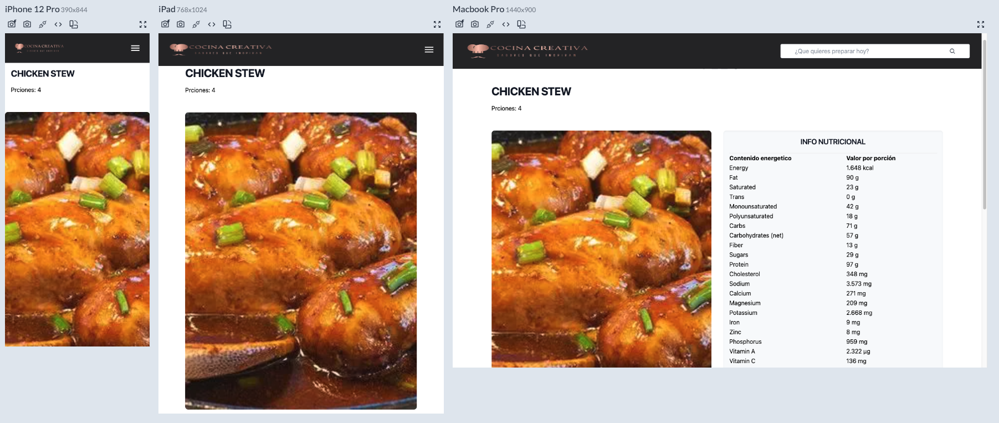
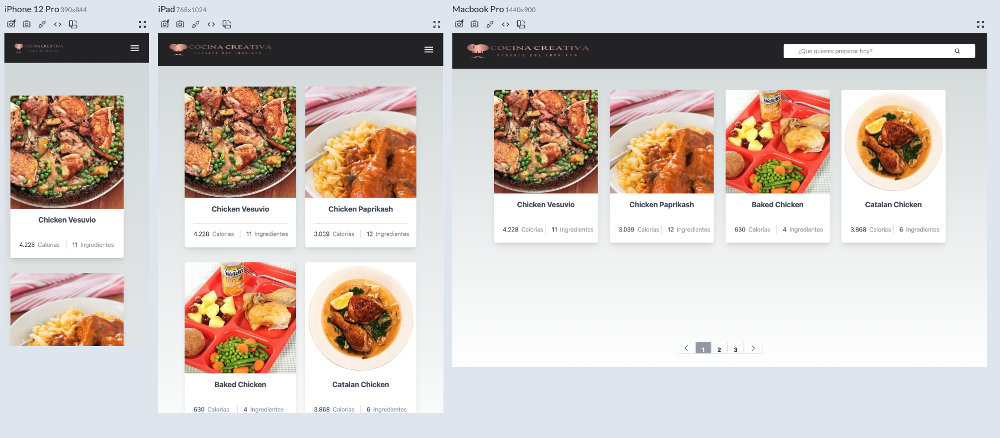
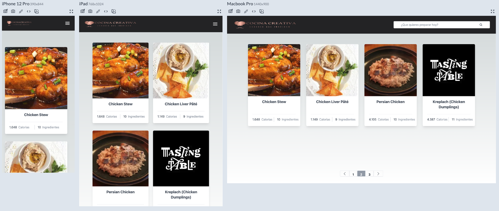
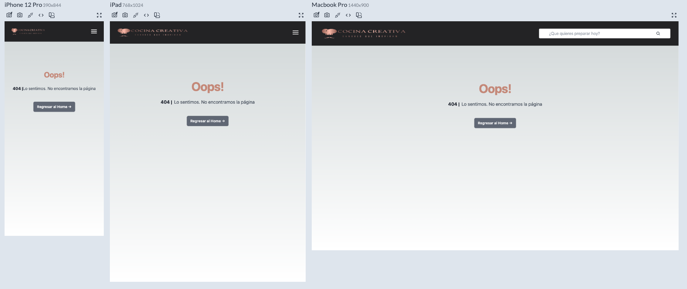

# Cocina Creativa

  Esta aplicación está desarrollada utilizando Next.js y TypeScript. Utiliza la API pública de Edamam para obtener las recetas. En la página de inicio, encontrarás un banner con las categorías disponibles y un buscador.
 
<br>

### Wed
<hr>

- **Prueba tú mismo:** [https://creative-cook.vercel.app/](https://creative-cook.vercel.app/)
<br>

<br>

### Clonar Repositorio
<hr>

```bash
  $ git clone https://github.com/andreajhl/creative-cook.git
```
<br>
<br>

### Cómo Probar
<hr>

* Después de clonar el repositorio, accede a la carpeta del proyecto desde tu editor de código favorito.
* En la terminal del proyecto, ejecuta el siguiente comando para instalar las dependencias: ```npm install```.
* Una vez finalizada la instalación, inicia el proyecto con el siguiente comando: ```npm run dev```.
* Si deseas ejecutar las pruebas, utiliza: ```npm run test```
<br>
<br>

### Tecnologías Utilizadas
<hr>

* #### Next.js
* #### React
* #### TypeScript
* #### Tailwind
* #### Jest
<br>
<br>

### Pantallas del Proyecto y Usos
<hr>

* ### Home
<br>

  La página de inicio cuenta con un carrusel de bienvenida, información sobre la pagina, un banner de categorías para seleccionar y un buscador para traer recetas relacionados.
<br>



<br>
<br>


* ### Listado de Recetas
<br>

  Ya sea que selecciones una categoría o busques un receta desde el formulario, llegarás a esta página donde encontrarás un listado de recetas encontradas (hasta 4 productos por página). Desde aquí, puedes ir a los detalles haciendo clic sobre el título.
<br>


<br>
<br>

* ### Detalles de la Receta
<br>

  En esta pantalla podrás encontrar la lista de ingredientes, la tabla nutricional, para cuantas porciones alcanza y su categoria.
<br>


<br>
<br>

* ### Página 404
<br>

  Si ocurre algun error cargando algun modulo o intentas acceder a una página que no existe, serás redirigido aquí. No te preocupes, puedes volver a la página de inicio desde el logotipo ubicado en la esquina superior izquierda o desde el boton.
<br>


<br>
<br>
